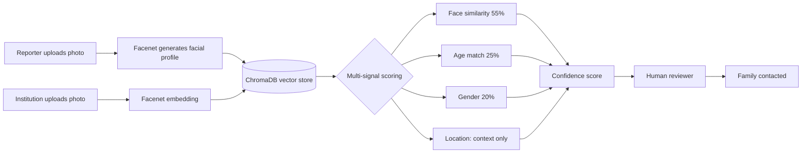

# TraceKE
### Missing Persons Identification Support System

*Tupatane. Let's find each other.*

[](https://www.python.org/)
[](https://traceke.streamlit.app/)
[]()
[]()

**[Live Demo →](https://traceke.streamlit.app/)**

</div>

---

## App Snippet


<div align="center">

---

## The problem we are trying to solve

In 2024, 170 women were killed in Kenya. It was the deadliest year on record for Kenyan women, double the annual average from 2016 to 2023.

They were found in rivers. In lodges. In thickets. On roadsides. 75 percent were killed by someone they knew — a husband, a boyfriend, a family member. Nairobi recorded the highest number of cases, followed by Nakuru and Kiambu. These are only the cases that made media reports. The real number is almost certainly higher.

The women have names. Starlet Wahu. Mercy Kwamboka. Rebecca Cheptegei, an Olympic athlete, set on fire by her ex-partner in September 2024. Agnes Tirop. Damaris Mutua. Each one a daughter, a sister, a mother. Each one reduced by the system to a case number, if she was lucky enough to get one at all.

Children are disappearing too. Over 8,800 were reported missing in Kenya in 2024 alone, and that's just the documented cases,roughly 17 to 18 children a day. In the 2023–2024 fiscal year, over 7,000 children vanished nationwide; only 1,383 were reunited with their families. The rest are still out there. Or they are not.

There is no single national database tracking every missing child. Many disappearances go unreported or are logged too late. A child found confused and alone in a Nairobi hospital may never be connected to the family looking for them in Eldoret not because nobody cares, but because no shared system exists to make that connection.

This is the gap TraceKE tries to close.

---

## 🔍 What TraceKE does

A web-based identification support system with two entry points and one matching engine.

**Reporters** — families, police, neighbours, social workers register a missing person with photos and case details. The system generates a facial profile and stores it alongside the case.

**Institutions** — hospitals, mortuaries, children's homes, police stations, NGOsupload a photo of an unidentified person. The system searches for similar facial profiles and returns the closest matches, ranked by a multi-signal confidence score.

A match above the confidence threshold is logged in an auditable record and surfaced to a human reviewer. The reviewer — not the algorithm — decides whether to contact the family.

### ✨ Features

**Reporters Portal**
- Register a case with name, age, sex, height, last-seen location, clothing, distinguishing features
- Upload up to 5 photos, multiple angles and lighting produce a more robust facial profile
- Automatic age progression display, so reviewers think in present terms
- Unique, shareable case ID per registration

**Institution Portal**
- Upload a photo of an unidentified person found at a hospital, mortuary, shelter, or station
- Returns up to 3 closest potential matches
- Full confidence breakdown — face similarity, age match, gender — so reviewers see *why* it flagged a match
- Location shown as context only, never scored a person found 400km away may have been trafficked, so distance carries a flag instead of a penalty

**Tip Submission**
- No account needed a boda boda rider, neighbour, or shopkeeper can upload a photo and location
- Tips are checked against active cases and flagged for human review before any family is contacted

**Dashboard**
- Cases sorted by urgency children missing in the last 72 hours surface first
- Status tracking: Open, Under Review, Resolved, Closed
- Summary stats: open cases, resolved cases, matches flagged, tips received

**Match Log**
- Every flagged match is permanently recorded with timestamp, confidence scores, case IDs
- Full audit trail, including who reviewed it and what followed

### ⚙️ How the matching works

TraceKE doesn't rely on face similarity alone every match is scored across multiple signals:



| Signal | Role |
|---|---|
| Face similarity (Facenet) | Primary — 55% of final score |
| Estimated age match | Supporting — 25% |
| Gender | Supporting — 20% |
| Location distance | Context only — never penalised |
| Distinguishing features | Human review only — never scored |

If a signal is missing - height wasn't recorded, or distinguishing marks weren't known — it's excluded entirely and the remaining signals redistribute their weight. No case is penalised for incomplete data.

---

## What TraceKE does NOT do

TraceKE is an identification **support** system, not an identification **decision** system. This distinction matters enormously.

**It does not confirm identity.** Every result is labelled a *potential match requiring human verification*. The system never tells a family "we found your child." It tells a trained reviewer "this case is worth a second look."

**It does not monitor or surveil.** No cameras, no live feeds, no real-time scanning. It only processes photos deliberately uploaded by registered institutions or family members.

**It does not replace the police, NGOs, or community networks.** It is one additional tool. Investigation, community mobilisation, and family support cannot be automated.

---

## 🛠️ Technical stack

| Layer | Technology |
|---|---|
| Frontend | Streamlit |
| Face detection | YuNet via OpenCV — better dark-skin-tone performance than Haar Cascade |
| Face embeddings | facenet-pytorch / InceptionResnetV1 — 512-dim vectors, no TensorFlow dependency |
| Vector similarity search | ChromaDB (cosine similarity) |
| Case metadata storage | SQLite |
| Image preprocessing | OpenCV + CLAHE normalisation for skin-tone-neutral quality assessment |

---

## 🚀 Running locally

```bash
git clone https://github.com/kerubobosire254/traceke
cd traceke

python -m venv venv
source venv/bin/activate        # Windows: venv\Scripts\activate

pip install -r requirements.txt

streamlit run main.py
```

On first run, the app will:
1. Download the YuNet face detection model (~200KB)
2. Download the Facenet model weights (~90MB, one-time)
3. Seed the database with 15 demo cases

First startup takes ~30-60 seconds. Subsequent startups are fast.

---

## Limitations we are honest about

**1. Not trained on Kenyan data.** Facenet was trained predominantly on Western datasets. Accuracy on dark-skinned East African faces, especially in low-light, low-resolution conditions common in real intake scenarios, hasn't been independently benchmarked. This is the single most important limitation.

**2. Photo quality affects accuracy.** A blurry or low-res photo produces a less reliable embedding. TraceKE never rejects a photo for quality, it flags low-quality images to reviewers instead, because for some families, one old blurry photo is all they have.

**3. No identity verification on registration.** Anyone can register a case; there's no OTP or identity check yet. A known gap that introduces risk of abuse.

**4. Requires institutional adoption.** TraceKE only connects missing to found if hospitals, mortuaries, and police are actively uploading. Without institutional uptake, the matching engine has nothing to search against.

**5. Demo data is synthetic.** The 15 pre-loaded cases use random vectors, not real facial embeddings.

---

## 🗺️ What we want to build next

**A model fine-tuned on African faces** — the highest-impact improvement. Requires a labelled dataset, compute, and ethical data collection with full consent.

**Africa's Talking SMS alerts** — auto-notify the registered contact on a high-confidence match. The architecture already supports this.

**OTP verification on registration** — a Kenyan phone number + OTP before a case saves, reducing abuse risk and adding a direct line back to the reporter.

**Multilingual support** — Kenya has 40+ languages; the interface should work in Kiswahili at minimum. The hard part is capturing voice descriptions of distinguishing features accurately across languages.

**Integration with DCI, CPIMS, and NGO databases** — the most powerful version of TraceKE isn't standalone. It's a shared layer connecting the Directorate of Criminal Investigations, Kenya's Child Protection Information Management System, Missing Child Kenya, COVAW, and the organisations already doing this work manually.

---

## A note on ethics

TraceKE handles some of the most sensitive data that exists — photographs of missing and vulnerable people, biometric facial data, the details of disappearances that often involve violence, trafficking, or abuse.

We take this seriously.

- No photo is shared between parties without a human reviewer in the loop
- No family is ever contacted by the system only by a human who reviewed the match
- All match decisions are logged permanently for accountability
- Limitations are documented explicitly so no one over-trusts it
- Demo data is fictional no real vulnerable person's data was used

This is a prototype built by one developer. It is not production-ready. It should not be deployed in a real institutional context without independent security review, bias testing on a representative Kenyan dataset, legal review under the Kenya Data Protection Act 2019, and formal partnership with organisations that have the mandate and trust of the communities this tool is meant to serve.

But the problem is real. The gap is real. And someone has to start.

---

<div align="center">

### Built by

**Kerubo Bosire**
ML Engineer & Data Scientist, Nairobi, Kenya

*Actuarial brain. Data science hands. Built for the people who look like me, who live where I live, who are still waiting.*

*If you're working on missing persons technology in Kenya or East Africa and want to collaborate, reach out.*

</div>


